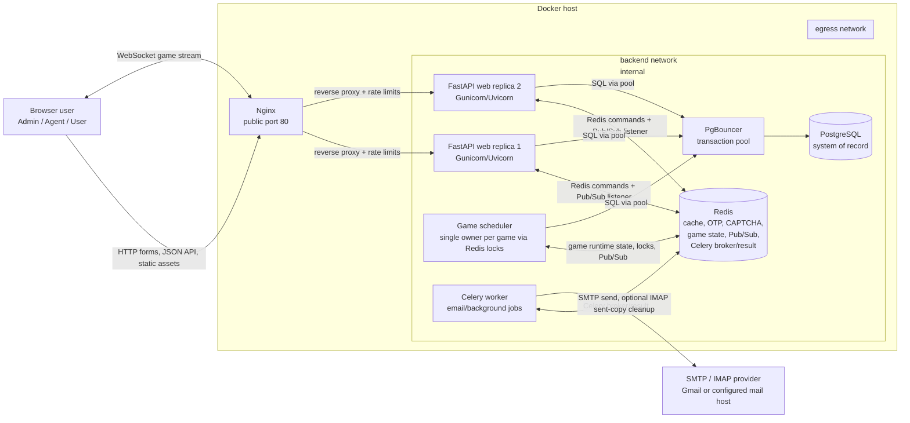
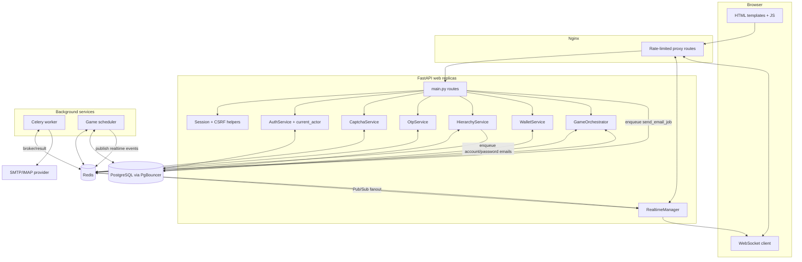
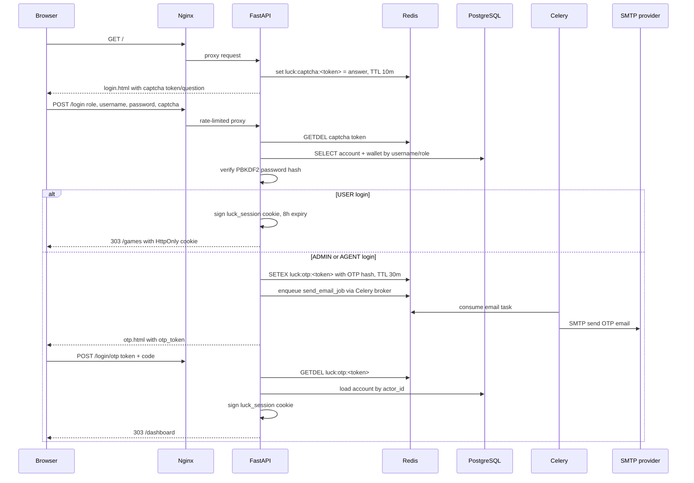
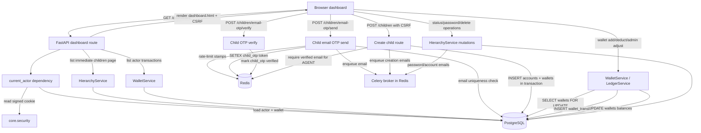
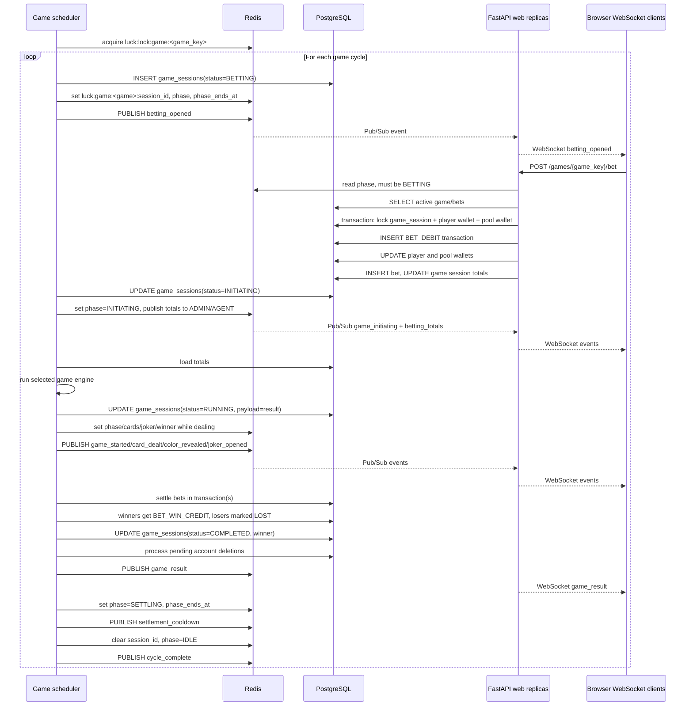
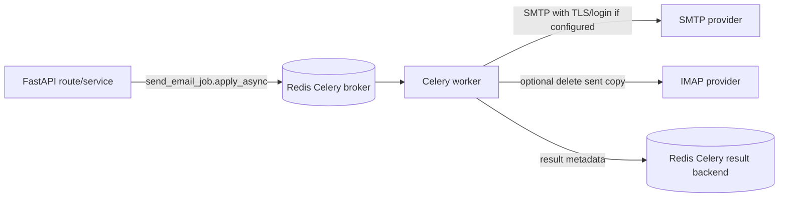

# Luck Game v2 Data Flow Diagram

This document describes the data flow for the web application in `using_claude_v2`.

## System Context

## Trust Boundaries

| Boundary | Components | Main controls |
| --- | --- | --- |
| Public internet / LAN to app | Browser to Nginx | Nginx request limits, body size limit, security headers |
| App network | Nginx to FastAPI replicas | Only Nginx exposes port 80; web containers stay on internal backend |
| Internal backend | FastAPI, scheduler, Celery, Redis, PgBouncer, Postgres | `backend` Docker network is internal |
| Outbound email | Celery to SMTP/IMAP provider | Celery also joins `egress` network for SMTP/IMAP access |
| Persistent data | PgBouncer to PostgreSQL | SQL transactions, row locks, uniqueness constraints |
| Ephemeral/shared state | App/scheduler/Celery to Redis | TTL keys, Redis locks, Pub/Sub channel |

## Data Stores

| Store | Owned data | Writers | Readers |
| --- | --- | --- | --- |
| PostgreSQL `accounts` | Admin/agent/user/system identities, hierarchy, status, email, password hash | Startup seed, hierarchy service, password/status/delete flows | Auth, dashboard, game access checks, scheduler cleanup |
| PostgreSQL `wallets` | Wallet balances, owner, status, optimistic version | Wallet service, game betting, scheduler settlement/recovery | Dashboard, auth actor loading, game betting |
| PostgreSQL `wallet_transactions` | Auditable money movements and idempotency keys | Wallet service, bet placement, scheduler settlement/recovery | Dashboard, CSV downloads |
| PostgreSQL `game_sessions` | Game cycle records, totals, result payload, winner, status | Scheduler, bet placement totals | Game API, WebSocket initial state, active-game checks |
| PostgreSQL `bets` | Player bets by session, side, amount, status | Game bet API, scheduler settlement/recovery | Game API, active-game checks, settlement |
| PostgreSQL `pending_account_deletions` | Deferred subtree deletions while games are active | Hierarchy service | Scheduler post-settlement cleanup |
| Redis `luck:captcha:*` | One-time CAPTCHA answer with TTL | Login page | Login POST |
| Redis `luck:otp:*` | Login OTP token and hash with TTL | Login POST | Login OTP POST |
| Redis `luck:child_otp:*` | Agent email verification OTP state | Agent creation OTP flows | Credential generation/account creation |
| Redis `luck:admin_pwd_otp:*` | Admin password-change OTP state | Admin OTP send | Admin password update |
| Redis `luck:otp_rate:*` | OTP send rate timestamps | OTP send flows | OTP send flows |
| Redis `luck:game:<game>:*` | Current phase, session, timers, cards, winner | Scheduler | Web/API/WebSocket initial state |
| Redis `luck:lock:game:<game>` | Scheduler ownership lock | Scheduler | Scheduler |
| Redis Pub/Sub channel | Realtime game events | Scheduler or realtime manager | Web replicas, local WebSocket clients |
| Redis Celery DBs | Email task queue/results | FastAPI services | Celery worker |

## Main Data Flow

## Login And Session Flow

Important security properties:

| Data item | Location | Lifetime |
| --- | --- | --- |
| CAPTCHA answer | Redis `luck:captcha:<token>` | 10 minutes, consumed with `GETDEL` |
| OTP code | Never stored directly; SHA-256 hash stored in Redis | 30 minutes, consumed or deleted |
| Session | Signed `luck_session` cookie | 8 hours |
| Password | PBKDF2-HMAC-SHA256 salted hash in Postgres | Persistent |
| CSRF token | HMAC bound to current session cookie | Generated per rendered form |

## Dashboard, Account, And Wallet Flow

Wallet transfer invariant:

1. Every balance-changing transfer writes a `wallet_transactions` row.
2. Wallet rows are locked with `SELECT ... FOR UPDATE` before balance changes.
3. Wallet locks are ordered by wallet id where two wallets are involved to reduce deadlocks.
4. Idempotency keys prevent duplicate settlement/refund/payout transactions.

## Game Runtime Flow

## Game State By Responsibility

| Responsibility | Component | Data written | Data read |
| --- | --- | --- | --- |
| Start cycle | Scheduler | `game_sessions`, Redis `phase/session_id/phase_ends_at` | Redis scheduler lock |
| Accept bet | FastAPI `GameOrchestrator.place_bet` | `bets`, `wallet_transactions`, `wallets`, `game_sessions.group_*_total` | Redis phase, Postgres actor/wallet/session |
| Show current state | FastAPI route/WebSocket initial response | None | Redis game state, Postgres totals/history |
| Deal game result | Scheduler + game engine | Redis `cards_dealt`, `joker`, `winner`, `winning_card`; Postgres `payload` | Postgres game totals |
| Settle money | Scheduler | `wallet_transactions`, `wallets`, `bets`, `game_sessions` | Postgres bets/wallets/settings |
| Realtime fanout | Scheduler + Redis + web replicas | Redis Pub/Sub message | Local WebSocket connections |
| Recover interrupted cycles | Scheduler startup | refund transactions, bet statuses, failed sessions | non-completed sessions |

## Email Flow

Email-producing flows:

| Trigger | Recipient | Subject pattern |
| --- | --- | --- |
| Admin/agent login OTP | Actor email | `Luck Game login OTP` |
| Agent email verification | New agent email | `Luck Game agent email verification OTP` |
| Admin password change OTP | Admin email | `Luck Game admin password change OTP` |
| Child account creation | Parent email; agent child email | Account created/details |
| Password regeneration/change | Parent and/or affected actor email | Password regenerated/changed |

## Route-Level Data Flow Summary

| Route group | Input | Main processing | Output |
| --- | --- | --- | --- |
| `/`, `/login`, `/login/otp`, `/logout` | Form data, CAPTCHA, OTP | Redis CAPTCHA/OTP, Postgres credential lookup, signed cookie | Login page, OTP page, redirects |
| `/dashboard` | Session cookie, filters/page | Postgres children and transactions; CSRF token generation | Dashboard HTML |
| `/children*`, `/credentials/generate` | Session, forms, CSRF, email OTP token | Permission checks, Redis child OTP, Postgres account/wallet writes | Redirects or JSON credentials/OTP status |
| `/password*` | Session, forms, CSRF, admin OTP | Postgres password verification/update, Redis admin OTP, email queue | Redirects or JSON OTP token |
| `/wallet*` | Session, amount, child id, CSRF | Postgres wallet locks, transaction rows, balance updates | Redirects |
| `/download/*` | Session | Postgres reads | CSV streaming response |
| `/games`, `/games/{game_key}` | Session, game key | Redis/Postgres current state; CSRF | Game pages |
| `/api/me`, `/api/games/{game}/my-bets` | Session | Postgres actor/bet reads, Redis/DB active game lookup | JSON |
| `/games/{game}/bet` | Session, side, amount, CSRF or JSON accept | Redis phase check, Postgres locks and bet debit transaction | Redirect or JSON |
| `/ws/games/{game_key}` | Session cookie over WebSocket | Auth lookup, current state read, Redis Pub/Sub delivery | Initial state and live game events |

## Failure And Consistency Paths

| Scenario | Handling |
| --- | --- |
| Web replica restarts | No in-memory critical state; sessions are signed cookies, game/OTP/CAPTCHA state is Redis, durable data is Postgres |
| Multiple web replicas | Redis Pub/Sub fanout lets each replica deliver events to its own local WebSocket clients |
| Multiple scheduler instances | Redis distributed lock `luck:lock:game:<game_key>` lets one scheduler own each game |
| Scheduler restarts mid-cycle | Startup recovery refunds placed bets for non-completed sessions and marks sessions failed |
| Account deletion while bets are active | Subtree is marked inactive and recorded in `pending_account_deletions`; scheduler processes deletion after active games finish |
| Concurrent wallet operations | Wallet rows are locked in Postgres transactions; transaction ledger is written with balance before/after |
| Duplicate settlement/refund attempts | Idempotency keys in `wallet_transactions` prevent duplicate successful money movements |
| SMTP temporary failure | Celery email task retries transient DNS/socket/connection failures |

## Notes On Current Deployment Shape

- `nginx` is the only public HTTP entry point.
- `web` runs two replicas and stores no critical per-process game state.
- `backend` is an internal Docker network; Postgres, Redis, PgBouncer, web, scheduler, and Celery communicate there.
- `celery_worker` additionally joins `egress` so it can resolve and connect to SMTP/IMAP providers.
- PgBouncer sits between app processes and PostgreSQL, while application code still uses explicit SQL transactions for money/game mutations.
